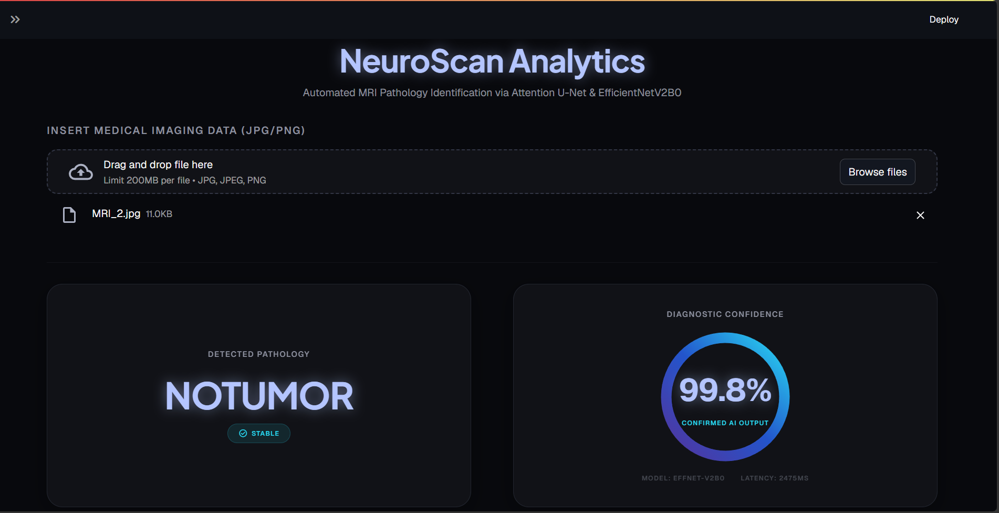
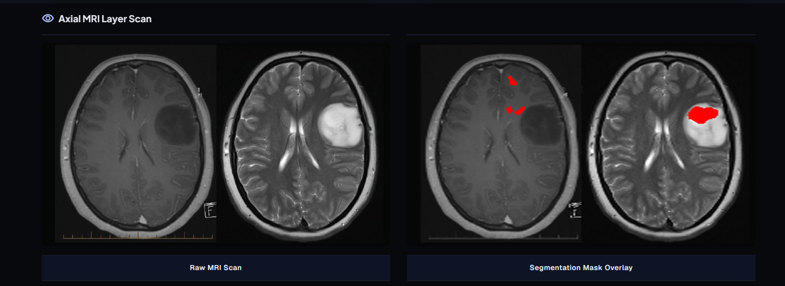
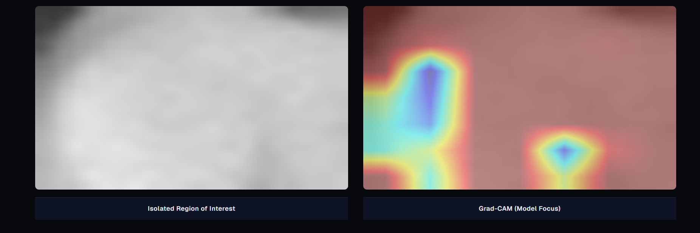
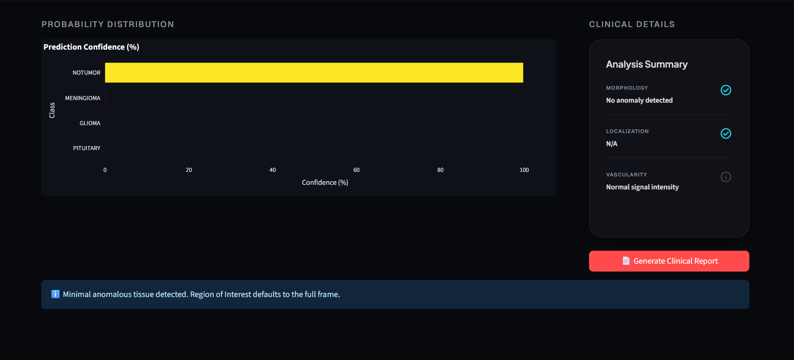

# NeuroScan: MRI Pathology Analysis Pipeline 🧠

NeuroScan is an end-to-end computer vision pipeline for segmentation and classification of brain tumor pathologies from MRI scans. It combines an attention-based segmentation model with a transfer-learning classifier, and adds explainability through Grad-CAM heatmaps.

The pipeline takes a raw MRI scan, localizes the region of interest, classifies the tumor type, and visualizes which regions drove the model's decision.

---

## 🏗️ Architecture Overview

```
                             ┌────────────────────┐
                             │    Raw MRI Scan    │
                             │    (224 x 224)     │
                             └─────────┬──────────┘
                                       │
                                       ▼
                      ┌─────────────────────────────────┐
                      │         Attention U-Net         │
                      │  (SeparableConv2D + Attention   │
                      │     Gates, BCE + Dice Loss)     │
                      └────────────────┬────────────────┘
                                       │
                               Segmentation Mask
                                       │
                                       ▼
                      ┌─────────────────────────────────┐
                      │    Region of Interest (ROI)     │
                      │           Extraction            │
                      └────────────────┬────────────────┘
                                       │
                                       ▼
                      ┌─────────────────────────────────┐
                      │        EfficientNetV2B0         │
                      │ (Transfer Learning Classifier)  │
                      └────────────────┬────────────────┘
                                       │
                      ┌────────────────┴────────────────┐
                      ▼                                 ▼
           ┌─────────────────────┐         ┌─────────────────────────┐
           │   Predicted Class   │         │        Grad-CAM         │
           │ Glioma / Meningioma │         │ Explainability Heatmap  │
           │ Pituitary/No Tumor  │         │                         │
           └──────────┬──────────┘         └────────────┬────────────┘
                      │                                 │
                      └────────────────┬────────────────┘
                                       ▼
                      ┌─────────────────────────────────┐
                      │    Streamlit Dashboard (UI)     │
                      │  + FastAPI Inference Endpoint   │
                      └─────────────────────────────────┘
```

---

## 🖥️ Dashboard Preview


*Upload an MRI scan to begin the autonomous workflow.*


*Raw MRI Scan and Segmentation Mask Overlay*


*Isolated Region of Interest and Grad-CAM Model Focus*


*Confidence probability distribution and detailed clinical summary.*

---

## 🌟 Core Features

- **Segmentation (Attention U-Net)**: A custom SeparableConv2D-based U-Net (224×224 resolution) enhanced with Attention Gates to focus on tumor regions of varying shapes and sizes. Trained with a combined BCE + Dice Loss to handle class imbalance between tumor and background pixels.
- **Classification (EfficientNetV2)**: An EfficientNetV2B0 backbone fine-tuned via transfer learning to categorize scans into four classes — Glioma, Meningioma, Pituitary, or No Tumor.
- **Explainable AI (Grad-CAM)**: Gradient-weighted Class Activation Mapping generates heatmaps over the input scan, highlighting which regions most influenced the classification decision.
- **Dashboard & API**: A Streamlit dashboard for interactive use, and a FastAPI backend exposing a prediction endpoint. Both are containerized with Docker via `docker-compose`.

---

## 📊 Model Performance (Evaluated on Held-out Sets)

**Pathology Classifier (EfficientNetV2B0)**

Overall test accuracy: **94.06%** (1,600 held-out test images, 4 classes)

| Class | Precision | Recall | F1-Score |
|---|---|---|---|
| Glioma | 0.98 | 0.80 | 0.88 |
| Meningioma | 0.90 | 0.97 | 0.93 |
| Pituitary | 0.98 | 1.00 | 0.99 |
| No Tumor | 0.91 | 1.00 | 0.95 |

The classifier performs strongly across all classes, with Glioma recall (0.80) being the main area for improvement — gliomas are occasionally confused with meningioma or no-tumor scans, likely due to overlapping visual presentation on certain slices.

**Region Extractor (Attention U-Net)**

- Dice Coefficient: **0.7767**
- Pixel Accuracy: **99.84%**
- Mean IoU: **0.4957**

Dice coefficient is the primary segmentation metric here, since pixel accuracy is inflated by the large proportion of background pixels in brain MRI scans. Mean IoU is computed on thresholded binary masks and is more conservative than Dice for this task; a Dice score of ~0.78 represents strong tumor-region overlap given the irregular shapes of gliomas.

---

## 🛠️ System Components

| Subsystem | Technology | Details |
|-----------|----------------------|---------|
| **Region Extractor** | Attention U-Net | `SeparableConv2D` + Attention Gates, trained with BCE + Dice Loss |
| **Pathology Classifier** | EfficientNetV2B0 | ImageNet-pretrained base + custom GlobalAvgPool dense head |
| **Explainability (XAI)** | Grad-CAM | Heatmap generation over the final convolutional layer |
| **Inference API** | FastAPI | RESTful API exposing `/api/v1/predict` |
| **Data Pipeline** | `tf.data` API | Caching, prefetching, and stochastic augmentation |
| **Dashboard** | Streamlit + Plotly | Upload scans, view segmentation masks, classification confidence, and Grad-CAM heatmaps |

---

## 🚀 Getting Started

### 1. Environment Setup

Ensure you have Python 3.9+ installed.

```bash
git clone <repository-url>
cd <repository-directory>
python -m venv venv
source venv/bin/activate  # On Windows: venv\Scripts\activate
pip install -r requirements.txt
```

### 2. Configuration

NeuroScan is driven by `config.yaml`. Modify hyperparameters and dataset paths directly, or override them using environment variables (see `.env.example`).

```bash
cp .env.example .env
# Edit .env with your dataset paths
```

### 3. Model Training

```bash
# Train the segmentation model
python scripts/train_segmenter.py --config config.yaml

# Train the classification model
python scripts/train_classifier.py --config config.yaml
```

### 4. Running the Dashboard and API

**Local (Streamlit only):**
```bash
python -m streamlit run app/dashboard.py
```

**Containerized (Dashboard + API):**
```bash
docker-compose up --build
```
- API available at: `http://localhost:8000`
- Dashboard available at: `http://localhost:8501`

---

## 🧪 Testing

Activate the virtual environment first, then run:

```bash
# On Windows
venv\Scripts\activate

pytest tests/ -v
```

> **Note:** `test_api.py` requires `httpx` (included in `requirements.txt`). Ensure the venv is active before running tests so the correct package versions are used.

---

## 📁 Repository Map

```
.
├── config.yaml                  # Master hyperparameter configuration
├── pyproject.toml               # Package build config & pytest settings
├── conftest.py                  # Root pytest path setup
├── requirements.txt             # Dependency graph
├── docker-compose.yml           # Service orchestration
├── Dockerfile                   # Container image definition
├── app/                         # Frontend & Backend Applications
│   ├── dashboard.py             # Streamlit entry point
│   └── api.py                   # FastAPI application entry point
├── neuroscan/                   # Core Package
│   ├── config_loader.py         # YAML/Env var processor
│   ├── data_pipeline.py         # tf.data.Dataset orchestrator
│   ├── seg_model.py             # U-Net architecture definitions
│   ├── cls_model.py             # EfficientNet architecture definitions
│   ├── trainer.py               # Training loop and callbacks
│   ├── inference.py             # End-to-end prediction pipeline
│   ├── explainability.py        # Grad-CAM heatmap generation
│   └── visualizer.py            # Plotly abstractions
├── scripts/
│   ├── evaluate_models.py       # Model evaluation script
│   ├── generate_synthetic_data.py # Synthetic data generator
│   ├── kaggle_train_script.py   # Kaggle training script
│   ├── train_segmenter.py       # Segmentation CLI
│   ├── train_classifier.py      # Classification CLI
│   └── convert_tif_to_png.py    # Dataset format conversion utility
├── checkpoints/                 # Saved model weights (.keras)
├── data/
│   └── raw/
│       ├── segmentation/        # LGG segmentation dataset (image + mask pairs)
│       └── classification/      # Brain tumor classification dataset
└── tests/                        # Pytest automation suite
    ├── conftest.py
    ├── test_seg_model.py
    ├── test_cls_model.py
    ├── test_data_pipeline.py
    ├── test_inference.py
    ├── test_explainability.py
    ├── test_visualizer.py
    └── test_api.py
```

---

## 🚀 Future Improvements

- **3D MRI Support**: Extend the pipeline to process 3D NIfTI volumes instead of 2D slices.
- **Multimodal Fusion**: Integrate T1, T1Gd, T2, and FLAIR sequences simultaneously for richer feature extraction.
- **Federated Learning**: Implement federated training to preserve patient data privacy across multiple clinical sites.
- **Deployment**: Provide Kubernetes Helm charts for scalable enterprise deployment.
